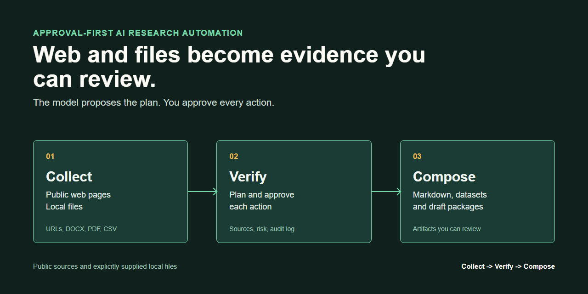

# 通用可配置 Crawler

> 面向允许访问的公开网页，以受信任 YAML 配置 Playwright 采集并输出本地
> JSON、JSONL 或 CSV。审批优先的研究助手是可选上层，不是运行 Crawler
> 的前置条件。

[](https://github.com/Ulysses-G-Yang/approval-first-research-automation/actions/workflows/ci.yml)
[](https://www.python.org/downloads/)
[](LICENSE)

[English README](README.md)

> **状态：Alpha。** 当前源码是 `v2.1.0` 候选版本；高级自愈和平台适配器
> 仍为实验模块，最新正式 Release 仍是 `v2.0.1`。

## 这个项目是什么

主产品是 `GenericSpider`：它把受信任的 YAML 定义转换为本地结构化记录。
配置可以声明允许访问的起始 URL、浏览器参数、分页、页面或列表选择器以及输出
字段，不必把某个网站的规则硬编码进引擎。

仓库同时包含一个可选的审批优先助手。它可以把 Crawler 和本地文档工具包装成
可审查、可追踪的工作流，但直接运行 Crawler 不需要启用助手。

本项目不承诺兼容任意网站，不提供反爬或访问控制绕过，不保证不可检测，也不
保证选择器一定能够自动修复。

## 当前能力状态

| 层级 | 能力 | 状态 | 当前边界 |
| --- | --- | --- | --- |
| Crawler 核心 | YAML 配置化 Playwright 采集 | **有限可用** | Windows/Linux wheel 测试会导入并配置 `GenericSpider`；尚未基准验证真实浏览器执行和网站覆盖率。 |
| Crawler 核心 | 配置化 CSS 字段提取 | **已测试** | 本地 HTML 夹具覆盖选择器成功和失败。 |
| Crawler 核心 | 分页及 JSON/JSONL/CSV 输出 | **有限可用** | 已实现，但没有公开的跨站兼容性基准。 |
| Crawler 核心 | 自适应回退控制路径 | **有限可用** | 由确定性替身覆盖；尚未对真实 Scrapling 恢复能力做基准验证。 |
| Crawler 核心 | Page Evolution Lab | **已测试** | 确定性本地夹具，不代表目标网站兼容性。 |
| Crawler 核心 | 五层自愈、QualityGate、修复记忆 | **实验性** | 原型模块尚未接入正式 `GenericSpider` 路径。 |
| Crawler 核心 | 电商 Adapter 与域名匹配 | **实验性** | 只有一个模板和候选域名字符串，不代表已验证支持 19 个网站。 |
| 可选助手 | 本地 CSV/JSON/TXT/Markdown 报告 | **已测试** | 有可重复的离线工作流。 |
| 可选助手 | DOCX、文本型 PDF 转 Markdown | **已测试** | 扫描页会保留，但不做 OCR。 |
| 可选助手 | 审批绑定执行与恢复 | **有限可用** | 当前任务空间已测试指纹、进程锁、异常恢复和版本化产物；旧任务空间只能查看/导出，中断的远程或模型调用必须人工复核。 |
| 可选助手 | 公开 HTTP 与受审查浏览器访问 | **有限可用** | 连接阶段网络加固见 [#6](https://github.com/Ulysses-G-Yang/approval-first-research-automation/issues/6)。 |
| 可选助手 | 离线内容草稿包 | **已测试** | 只创建本地文件，不上传、不发布。 |

完整能力边界见[产品范围](docs/PRODUCT_SCOPE.md)，实施顺序见唯一权威
[路线图](ROADMAP.md)。

## 从源码运行 Crawler

当前验证的运行时是 Python 3.12。

```bash
git clone https://github.com/Ulysses-G-Yang/approval-first-research-automation.git
cd approval-first-research-automation
python -m venv .venv

# Windows PowerShell
.venv\Scripts\Activate.ps1
python -m pip install --upgrade pip
python -m pip install -e .

# macOS/Linux
source .venv/bin/activate
python -m pip install --upgrade pip
python -m pip install -e .
```

浏览器采集还需要安装 Chromium：

```bash
playwright install chromium
```

为允许访问的公开网页创建受信任的 `crawler.yaml`：

```yaml
name: public-page-example
start_url: https://example.com/
browser:
  headless: true
request:
  wait_until: domcontentloaded
pagination:
  enabled: false
fields:
  - name: title
    selector: h1
  - name: url
    source: page_url
    scope: page
```

运行主 Crawler 入口：

```bash
python extract_prices.py \
  --config crawler.yaml \
  --output output/records.json
```

直接 Crawler 配置属于受信任的类代码输入：Standalone 模式允许配置浏览器启动
和 context 参数，也支持可选 JavaScript actions。只使用你自己控制的配置，并且
只访问你有权访问的目标。

如需完全离线验证选择器演化路径：

```bash
python -m labs.page_evolution.run_lab --json
```

该实验不会启动浏览器或访问第三方网站。它只是回归夹具，不代表广泛网站支持。

候选 wheel 包含 `core`、`adapters`、`research_assistant` 和内置 workflows。
CI 会在 Windows、Linux 的仓库外安装并实例化 `GenericSpider`，但不会启动浏览器。
`v2.1.0` 尚未发布，因此当前仍以源码目录作为安装入口。

## 可选的审批优先助手



可选的 `agent` 命令会在 Crawler、网页、文件和文档工具外增加逐步审查、本地任务
空间、产物和审计信息。

```bash
agent doctor
agent list-workflows
agent run "汇总市场记录" \
  --workflow file_report \
  --input examples/research-report/market-notes.csv
```

命令会显示任务 ID 和第一步计划。检查后，每次只批准并执行一步：

```bash
agent status <TASK_ID>
agent approve <TASK_ID> step-01
agent resume <TASK_ID>
```

确定性工作流不要求配置模型。Provider 和模型辅助规划见
[AI Research Assistant](docs/AI_RESEARCH_ASSISTANT.md)。

### 可选 Assistant 工作流

| 工作流 | 用途 |
| --- | --- |
| `crawler_report` | 执行经过审查的 Crawler YAML 并生成本地报告。 |
| `file_report` | 从明确提供的本地文件生成可追踪报告。 |
| `research_report` | 组合已批准的公开 URL 与本地来源。 |
| `web_to_markdown` | 从已批准来源生成 Markdown 知识包。 |
| `document_to_markdown` | 转换 DOCX、文本型 PDF、Markdown 或文本。 |
| `content_save_draft` | 准备离线的平台格式草稿包。 |

输入和预期产物见[工作流编写说明](docs/WORKFLOW_AUTHORING.md)与
[示例目录](examples/README.md)。

## 安全边界

### 直接 Crawler

- 不逐步审批，直接运行用户提供的受信任 YAML。
- 可以使用明确配置的浏览器参数和 JavaScript actions。
- 只能用于操作者有权访问的网页。
- 不是网络沙箱，不承诺绕过访问控制或反爬系统。

### 可选 Assistant

- 模型只能建议已注册工具及其声明参数。
- 工具只能读取任务中明确提供的 URL 或本地文件。
- 凭据保存在操作系统凭据库中，工作流和 Assistant Crawler YAML 只保存引用名。
- Assistant 使用的 Crawler YAML 会拒绝脚本动作和明文 API Key。
- 草稿工具只生成本地文件；内置工具不会登录、上传、保存平台草稿或发布。

安全问题报告方式见 [Security Policy](SECURITY.md)。

## 项目结构

```text
core/spider_engine.py   主 GenericSpider 引擎
extract_prices.py       源码目录 Crawler CLI
configs/                Crawler 配置模板
labs/                   本地页面演化夹具
adapters/               实验性 Adapter 接口和模板
research_assistant/     可选规划器、审批执行器、工具、Provider
workflows/              可选的版本化 Assistant 工作流
examples/               可重复离线示例
tests/                  Crawler 与工作流测试
```

两个层级彼此分开：

```text
受信任 YAML -> extract_prices.py -> GenericSpider -> JSON/JSONL/CSV

受审查任务 -> agent run --workflow crawler_report -> browser.extract -> GenericSpider
```

五层 `SelfHealingEngine`、`QualityGate`、`RepairPersistence` 和 Adapter 原型
尚未进入主 Crawler 路径。

## 开发验证

```bash
python -m unittest discover -s tests -v
python -m compileall -q extract_prices.py agent.py core adapters research_assistant workflows scripts labs
python -m labs.page_evolution.run_lab --json
git diff --check
```

贡献与发布要求见 [CONTRIBUTING.md](CONTRIBUTING.md) 和
[发布检查清单](docs/RELEASE_CHECKLIST.md)。

## 历史说明

仓库最初是淘宝数据采集教学项目。当前产品线把采集引擎泛化，早期单站点内容作为
不可变历史示例保留，不代表生产级能力。详见
[教育版本说明](docs/EDUCATIONAL_VERSION.md)。

审批模式的网页工具通过严格 Crawler 配置、批准主机检查和浏览器请求拦截提供应用层纵深防御，
但它不是完整的网络沙箱；DNS rebinding 残余风险见 [Security Policy](SECURITY.md)。
Standalone `GenericSpider` 的旧配置兼容模式不属于这条审批安全边界。

## 许可证

[MIT](LICENSE)
