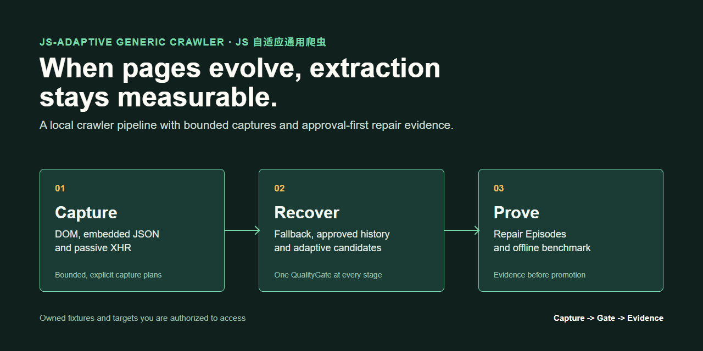

# JS 自适应通用爬虫

> JS-Adaptive Generic Crawler / JS 自适应通用爬虫

> 面向允许访问的公开网页，以受信任 YAML 配置 Playwright 采集并输出本地
> JSON、JSONL 或 CSV。审批优先的研究助手是可选上层，不是运行 Crawler
> 的前置条件。

[](https://github.com/Ulysses-G-Yang/approval-first-research-automation/actions/workflows/ci.yml)
[](https://www.python.org/downloads/)
[](LICENSE)

[English README](README.md)

> **状态：Alpha。** `v2.1.0` 是本地已测试确定性修复管线的发布源码；模型
> 质量仍属实验性，电商 Adapter 仍为有限可用，这不代表广泛真实站点兼容。

## 这个项目是什么

主产品是 `GenericSpider`：它把受信任的 YAML 定义转换为本地结构化记录。
配置可以声明允许访问的起始 URL、浏览器参数、分页、页面或列表选择器以及输出
字段，不必把某个网站的规则硬编码进引擎。

仓库同时包含一个可选的审批优先助手。它可以把 Crawler 和本地文档工具包装成
可审查、可追踪的工作流，但直接运行 Crawler 不需要启用助手。

本项目不承诺兼容任意网站，不提供反爬或访问控制绕过，不保证不可检测，也不
保证选择器一定能够自动修复。

## 当前能力状态

| 层级 | 能力 | 状态 | 当前边界 |
| --- | --- | --- | --- |
| Crawler 核心 | YAML 配置化 Playwright 采集 | **有限可用** | 受控 Chromium 集成测试覆盖本地网络与 capture 边界，Windows/Linux wheel 测试覆盖安装面；没有真实站点兼容性基准。 |
| Crawler 核心 | 配置化 CSS 字段提取 | **已测试** | 本地 HTML 夹具覆盖选择器成功和失败。 |
| Crawler 核心 | 分页及 JSON/JSONL/CSV 输出 | **有限可用** | 已实现，但没有公开的跨站兼容性基准。 |
| Crawler 核心 | 单一提取管线 | **已测试** | `配置选择器 → fallback → 已批准历史 → Scrapling → 可选 LLM → 空值`，各层共用 QualityGate。 |
| Crawler 核心 | 内嵌 JSON 与被动网络 JSON 捕获 | **有限可用** | 本地夹具覆盖内嵌状态和 GET/2xx/XHR/fetch JSON，不代表任意真实站点兼容。 |
| Crawler 核心 | JS Evolution Benchmark | **已测试** | 7 类确定性合成演化，外网调用和真实模型调用均为 0。 |
| Crawler 核心 | RepairEpisode v1 与 Experience Store | **已测试** | 显式启用的 SQLite 索引与本地 SHA-256 CAS；默认运行不创建文件。 |
| Crawler 核心 | 显式选择的电商 Adapter 候选规则 | **有限可用** | 仅通过 `GenericSpider.from_adapter(...)` 启用，并只以一个自有合成夹具验证；候选域名不是支持清单。 |
| 可选助手 | 本地 CSV/JSON/TXT/Markdown 报告 | **已测试** | 有可重复的离线工作流。 |
| 可选助手 | DOCX、文本型 PDF 转 Markdown | **已测试** | 扫描页会保留，但不做 OCR。 |
| 可选助手 | 审批绑定执行与恢复 | **有限可用** | 当前任务空间已测试指纹、进程锁、异常恢复和版本化产物；旧任务空间只能查看/导出，中断的远程或模型调用必须人工复核。 |
| 可选助手 | 公开 HTTP 与受审查浏览器访问 | **有限可用** | 已检查精确主机、公开 DNS、方法、请求数和运行时间；连接固定与浏览器总字节计量作为后续加固记录在 [#14](https://github.com/Ulysses-G-Yang/approval-first-research-automation/issues/14)，且不宣称网络沙箱。 |
| 可选助手 | 离线内容草稿包 | **已测试** | 只创建本地文件，不上传、不发布。 |

完整能力边界见[产品范围](docs/PRODUCT_SCOPE.md)，实施顺序见唯一权威
[路线图](ROADMAP.md)。

## 从源码运行 Crawler

当前验证的运行时是 Python 3.12。

```bash
git clone https://github.com/Ulysses-G-Yang/approval-first-research-automation.git
cd approval-first-research-automation
python -m venv .venv

# Windows PowerShell
.venv\Scripts\Activate.ps1
python -m pip install --upgrade pip
python -m pip install -e .

# macOS/Linux
source .venv/bin/activate
python -m pip install --upgrade pip
python -m pip install -e .
```

浏览器采集还需要安装 Chromium：

```bash
playwright install chromium
```

为允许访问的公开网页创建受信任的 `crawler.yaml`：

```yaml
name: public-page-example
start_url: https://example.com/
browser:
  headless: true
request:
  wait_until: domcontentloaded
pagination:
  enabled: false
fields:
  - name: title
    selector: h1
  - name: url
    source: page_url
    scope: page
```

运行正式 Crawler 入口：

```bash
crawler run --config crawler.yaml --output output/records.json
```

旧的 `python extract_prices.py --config ...` 继续作为兼容包装。

旧 YAML 仍然有效；需要 JS 数据时可选增加：

```yaml
captures:
  - name: bootstrap
    type: embedded_json
    selector: script#page-state
    required: true
    max_bytes: 1048576
  - name: catalog
    type: network_json
    url_glob: "https://example.com/api/catalog*"
    required: false
    max_bytes: 1048576
fields:
  - name: title
    source: bootstrap.props.items.0.title
```

`network_json` 只被动记录页面本来就发出的首个匹配 GET、2xx、XHR/fetch
JSON 响应，不会主动请求接口。

直接 Crawler 配置属于受信任的类代码输入：Standalone 模式允许配置浏览器启动
和 context 参数，也支持可选 JavaScript actions。只使用你自己控制的配置，并且
只访问你有权访问的目标。

执行完全离线的发布硬门槛：

```bash
crawler benchmark --json --check-baseline
```

基准会连续两次重放仓库内 DOM、内嵌状态、网络 JSON 和 hydration 合成夹具；
它只是回归证据，不代表广泛网站支持。

Repair Episode 默认关闭。只有显式传入本地存储路径才创建 SQLite/CAS：

```bash
crawler run --config crawler.yaml --output output/records.json \
  --experience-store output/experience.sqlite3
crawler episodes list --store output/experience.sqlite3 --json
crawler episodes show <EPISODE_ID> --store output/experience.sqlite3 --json
crawler episodes export <EPISODE_ID> --store output/experience.sqlite3 --json
```

非合成内容默认只保存结构。只有来源明确标记为 `authorized` 时，操作者才可额外传入
`--retain-full-episode-content`，显式选择保存已脱敏的完整文本/JSON；`public` 或
`unknown` 来源会拒绝该选项。

捕获、隐私、修复与晋升边界见 [JS 自适应 Crawler](docs/JS_ADAPTIVE_CRAWLER.md)。

`v2.1.0` 通过 GitHub Release 分发，资产限定为一个 wheel、一个 sdist 和
`SHA256SUMS.txt`，不发布到 PyPI。wheel 包含 `core`、`adapters`、
`research_assistant` 和内置 workflows；CI 会在 Windows、Linux 的仓库外
安装验证，同时继续支持从源码目录安装。

## 可选的审批优先助手



可选的 `agent` 命令会在 Crawler、网页、文件和文档工具外增加逐步审查、本地任务
空间、产物和审计信息。

```bash
agent doctor
agent list-workflows
agent run "汇总市场记录" \
  --workflow file_report \
  --input examples/research-report/market-notes.csv
```

命令会显示任务 ID 和第一步计划。检查后，每次只批准并执行一步：

```bash
agent status <TASK_ID>
agent approve <TASK_ID> step-01
agent resume <TASK_ID>
```

确定性工作流不要求配置模型。Provider 和模型辅助规划见
[AI Research Assistant](docs/AI_RESEARCH_ASSISTANT.md)。

### 可选 Assistant 工作流

| 工作流 | 用途 |
| --- | --- |
| `crawler_report` | 执行经过审查的 Crawler YAML 并生成本地报告。 |
| `file_report` | 从明确提供的本地文件生成可追踪报告。 |
| `research_report` | 组合已批准的公开 URL 与本地来源。 |
| `web_to_markdown` | 从已批准来源生成 Markdown 知识包。 |
| `document_to_markdown` | 转换 DOCX、文本型 PDF、Markdown 或文本。 |
| `content_save_draft` | 准备离线的平台格式草稿包。 |

输入和预期产物见[工作流编写说明](docs/WORKFLOW_AUTHORING.md)与
[示例目录](examples/README.md)。

## 安全边界

### 直接 Crawler

- 不逐步审批，直接运行用户提供的受信任 YAML。
- 可以使用明确配置的浏览器参数和 JavaScript actions。
- 只能用于操作者有权访问的网页。
- 不是网络沙箱，不承诺绕过访问控制或反爬系统。

### 可选 Assistant

- 模型只能建议已注册工具及其声明参数。
- 工具只能读取任务中明确提供的 URL 或本地文件。
- 凭据保存在操作系统凭据库中，工作流和 Assistant Crawler YAML 只保存引用名。
- Assistant 使用的 Crawler YAML 会拒绝脚本动作和明文 API Key。
- 草稿工具只生成本地文件；内置工具不会登录、上传、保存平台草稿或发布。

审批模式的网页工具通过严格 Crawler 配置、批准主机检查和浏览器请求拦截提供应用层
纵深防御，但它不是完整的网络沙箱；DNS rebinding 残余风险见
[Security Policy](SECURITY.md)。直接使用受信任配置运行 `GenericSpider` 不属于这条
审批安全边界。

安全问题报告方式见 [Security Policy](SECURITY.md)。

## 项目结构

```text
core/spider_engine.py   主 GenericSpider 引擎
core/crawler_cli.py     安装后的正式 Crawler CLI
extract_prices.py       兼容旧用法的源码包装器
configs/                Crawler 配置模板
labs/                   本地页面演化夹具
adapters/               实验性 Adapter 接口和模板
research_assistant/     可选规划器、审批执行器、工具、Provider
workflows/              可选的版本化 Assistant 工作流
examples/               可重复离线示例
tests/                  Crawler 与工作流测试
```

两个层级彼此分开：

```text
受信任 YAML -> crawler / extract_prices.py -> GenericSpider
             -> 单一提取管线 + 可选 captures -> JSON/JSONL/CSV

受审查任务 -> agent run --workflow crawler_report -> browser.extract -> GenericSpider
```

`SelfHealingEngine` 已是 `GenericSpider` 同一提取管线的兼容门面；
`QualityGate`、显式启用且仅复用已批准记录的 repair memory，以及
RepairEpisode 证据均已进入该路径。Adapter 不会按域名自动启用，只能显式调用
`GenericSpider.from_adapter(...)`。

## 开发验证

```bash
python -m unittest discover -s tests -v
python -m compileall -q extract_prices.py agent.py core adapters research_assistant workflows scripts labs
crawler benchmark --json --check-baseline
git diff --check
```

贡献与发布要求见 [CONTRIBUTING.md](CONTRIBUTING.md) 和
[发布检查清单](docs/RELEASE_CHECKLIST.md)。

## 历史说明

仓库最初是淘宝数据采集教学项目。当前产品线把采集引擎泛化，并保留一个无默认
目标的兼容示例；不可变的历史行为留在旧 tag 中。两者都不代表生产级能力。详见
[教育版本说明](docs/EDUCATIONAL_VERSION.md)。

## 许可证

[MIT](LICENSE)
