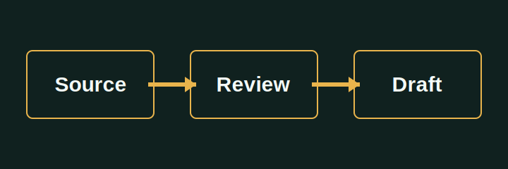

# A Review-Ready Draft

This article is intentionally local. The built-in workflow prepares an offline package but does not open a browser, upload media, save a platform draft, or publish.

## Human approval remains visible

The output manifest records the platform, copied asset IDs, `network_access: false`, and `published: false`.
