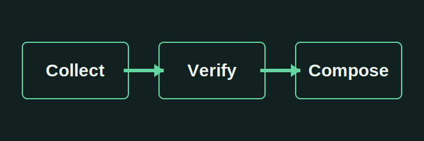

# A Local Document Example

This self-authored example demonstrates a Markdown input whose local image is copied into the task workspace.

## Reviewable output

The conversion workflow preserves a local asset reference instead of silently replacing it with a remote URL.
